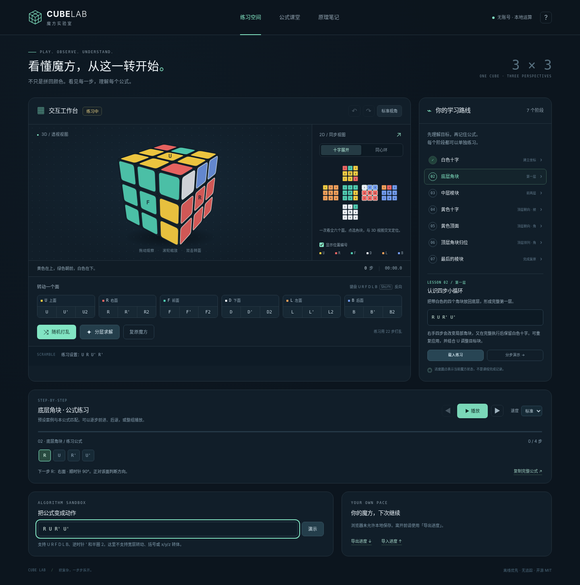

# Cube Lab · 魔方实验室

把每一次旋转，变成一次理解。

一个零运行时依赖、可离线使用的三阶魔方网页：真实三维几何投影、同步展开图、交叠圆轨道视图，以及从当前状态计算的七阶段公式求解。



## 立即使用

直接打开 [Cube Lab 在线版](https://bright-peng.github.io/cube-lab/)，无需下载或安装。推送到 `main` 后，GitHub Actions 会自动测试、构建并更新网站。

### 本地开发 / 最稳妥的启动方式

需要 Node.js 20 或以上；本次使用 Node.js 22.16.0 测试。无需 `npm install`，本项目没有 npm 运行时依赖。

```bash
cd cube-lab
npm start
```

打开终端显示的 `http://localhost:5173`。`npm run dev` 与 `npm start` 相同。更换端口可用 `PORT=8080 npm start`（macOS/Linux）。

### 单文件离线版

源码包中的 `dist/index.html` 已打包 CSS、JavaScript 和求解 Worker，可用浏览器打开。单独提供的 `cube-lab-offline.html` 与此文件相同。**不要直接双击源码根目录的 `index.html`：那一份使用 ES modules，应通过本地服务启动。**

若本机浏览器不允许文件页上的 Worker 或本地存储，程序会尝试主线程求解回退，并提示导出进度；也可改用上面的本地服务。运行游戏不需要访问第三方 CDN。页面中“参考资料”是自愿打开的外部链接。

构建环境的浏览器策略禁止 `file://` 和 HTTP 导航。因此，离线版的交互是在断网的 Chromium 中直接载入完整 HTML 测试的，**没有声称已实测本机双击打开、原生 localStorage 持久化或 Safari/Firefox 兼容性**。

## 已实现

- 3D：透视投影、遮挡排序、层转动动画；拖动改变观察方向，滚轮缩放，双击转面。
- 2D：十字展开图和三组交叠圆，与 3D 共用同一状态；色块选中高亮联动，可放大查看。
- 操作：18 种外层转动、键盘快捷键、随机打乱、复原、撤销/重做、练习计时。
- 教学：七阶段目标、适用条件、观察重点和配套案例；不是把公式盲目套到任意状态。
- 求解：根据当前合法状态生成分层公式；逐步前进、后退、播放、暂停及四档速度；结果先验证再展示。
- 保存：浏览器允许时自动保存当前状态；支持 JSON 进度导入/导出、完整公式复制。

## 第一次怎么玩

点「随机打乱」→「分层求解」→「下一步」。观察当前高亮面，再对照 3D 和展开图。熟悉后切到「公式课堂」，载入一个匹配案例，尝试自己输入公式。

| 操作 | 作用 |
| --- | --- |
| U / R / F / D / L / B | 转动对应面 |
| Shift + 字母 | 对应面逆时针 |
| 空格 | 播放 / 暂停（焦点不在按钮或输入框时） |
| 左 / 右方向键 | 求解上一步 / 下一步 |
| Ctrl/Cmd + Z | 撤销 |
| Ctrl/Cmd + Shift + Z | 重做 |
| 拖动 3D | 只改变视角，不改变 U/R/F 坐标定义 |
| 双击某面 / Shift + 双击 | 正转该面 / 反转该面 |

记号的顺逆时针，总是**正对正在转动的那个面**来判断。`R2` 是半圈，本项目计为一步。教程默认黄色 U 在上、白色 D 在下、绿色 F 在前。

## 七阶段解法

1. 白色十字：定位四个白色棱块，并匹配侧面中心。
2. 底层角块：用右手四步及其工作面/逆式变体完成第一层。
3. 中层棱块：用左右插入公式完成前两层。
4. 黄色十字：调整顶层棱块朝向。
5. 黄色顶面：用 Sune 及逆式调整角块朝向。
6. 顶层角块归位：用 T-perm 与顶层调整排列角块。
7. 最后棱块：用 U-perm 的工作面/逆式变体完成复原。

这是以分层学习为目标的混合教学路线。顶层使用常用 OLL/PLL 公式，但**不是完整 CFOP 速拧教程，也不是最短解求解器**。

## 交叠圆的含义

按照参考图，三组圆分别表示左右、上下、前后三层，每组有三个同心圆。不同组的圆两两相交，形成 54 个彩色交点，一一对应魔方的 54 张贴纸。

**圆表示层轨道，不表示一个面。** 每条轨道经过 12 张贴纸；外层转动 90° 时，这 12 张贴纸沿圆移动三格，同时本面自身的 8 张贴纸转位。点选彩点会高亮它所在的两条轨道，并在 3D 中追踪同一张贴纸。中心点标注面名，其他编号按该面的九宫格行优先 1–9 排列，点击「放大」可看清。

## 技术与结构

```text
index.html                    开发入口（ES modules）
src/core.js                   54 贴纸整数置换、记号解析、合法性验证
src/renderer.js               透视 3D / SVG 展开图 / 交叠圆
src/solver.js                 七阶段模式数据库与公式搜索
src/solver-worker.js          后台求解 Worker
src/lessons.js                中文课程与公式说明
src/app.js                    交互、播放器、导入导出
src/style.css                 响应式样式
scripts/serve.mjs              零依赖本地 HTTP 服务
scripts/build.mjs              固定模块图的单文件打包器
scripts/publish-github.sh      由账号所有者显式运行的发布脚本
.github/workflows/ci.yml       自动测试、构建与离线版下载
.github/workflows/pages.yml    手动部署 GitHub Pages
```

没有 NestJS 后端、数据库、账号系统或第三方分析 SDK。3D 用 Canvas 绘制真实空间坐标的透视投影，不依赖 WebGL 或 Three.js。计算在本机完成；优先使用 Worker，无法创建 Worker 时回退至主线程。

详细设计见 [架构与第一性原理](docs/ARCHITECTURE.md)。

## 测试与构建

```bash
npm test
npm run check
npm run build
node scripts/serve.mjs --dist
```

38 项 Node 测试通过，其中包含 200 组独立打乱求解，以及交叠圆的交点唯一性、轨道归属和转动顺序检查。初版另有 35 项离线 Chromium 交互检查记录。原浏览器检查脚本为可选开发工具，需要 Python 的 Playwright 和 Chromium：

```bash
python tests/browser_smoke.py
```

测试脚本优先使用环境变量 `CHROMIUM` 或系统 Chromium，否则使用 Playwright 自带的浏览器。测试边界与结果见 [测试报告](docs/TEST_REPORT.md)。

## 发布 GitHub

每次推送、Pull Request 或手动运行 **Test and build Cube Lab**，都会执行语法检查、核心测试和单文件构建。成功后可在 Actions 运行页面下载 `cube-lab-offline`，解压得到 `index.html`；产物保留 14 天。此流程不需要启用 Pages，也不需要额外配置密钥。

个人公开仓库：[bright-peng/cube-lab](https://github.com/bright-peng/cube-lab)。后续提交改动后，推送到 `main` 即可触发自动构建和 Pages 部署：

```bash
git push origin main
```

构建记录与下载见 [Actions](https://github.com/bright-peng/cube-lab/actions)，在线网址为 [bright-peng.github.io/cube-lab](https://bright-peng.github.io/cube-lab/)。更多说明见 [GitHub / Pages 部署指南](docs/DEPLOY.md)。

## 当前边界

仅支持标准三阶和 U/R/F/D/L/B 外层动作。不支持摄像头识别、手工涂色、宽层转动、M/E/S 中层动作、x/y/z 整体转体、多人对战或云同步。随机打乱属于训练用随机转动序列，不是 WCA 赛事均匀随机状态打乱。

刷新会恢复当前魔方与部分设置；播放路线和撤销栈不跨刷新保存，可重新求解。暂停会让当前转动完成后停住。2D 在一次转动完成时更新，动画中间并不把非 90° 状态当成合法魔方状态。

## 参考

- [WCA：动作记号](https://www.worldcubeassociation.org/regulations/#article-12-notation)
- [J Perm：三阶入门教程](https://jperm.net/3x3)
- [Cube Academy：分层求解](https://www.cube.academy/how-to-solve-a-rubiks-cube)
- [SpeedCubeDB：公式资料库](https://www.speedcubedb.com/a/3x3)

程序与课程文字独立编写，未复制第三方教程图片或嵌入第三方库。项目按 [MIT](LICENSE) 许可发布；魔方相关商标仍属于各自权利人，本项目不是官方产品。
